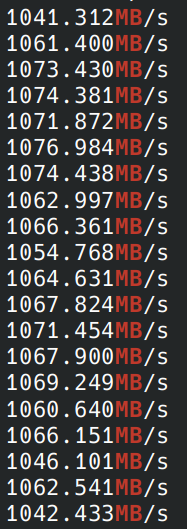

# Anoii

高效网络库

## 功能目标

- [x] TCP
- [x] 支持Linux，支持安卓
- [ ] 支持Windows
- [x] UDP
- [ ] tunnel加密通道
- [ ] 多线程支持
- [ ] fb制作简易的Linux图形界面
- [ ] 更多与其他库结合的例子
- [ ] ...

## 编译

### linux x86 x64

```shell
mkdir x86_64
cd x86_64
cmake -DCMAKE_BUILD_TYPE=Release ..
```

编译之后tcp loopback测试结果：
```shell
bin/chargenserver | grep MB
bin/chargenclient 0.0.0.0 9997 > /dev/null
```



### 安卓

1. 安装ndk

2. 执行命令

里面的android30是一个示例，根据你的手机版本选择合适的版本，比如android21等等。android30的动态连接在Redmi Note 7上可以正常运行，而android21不行。

```shell
mkdir android
cd android
cmake -DCMAKE_C_COMPILER=/opt/android-ndk/toolchains/llvm/prebuilt/linux-x86_64/bin/aarch64-linux-android30-clang  -DCMAKE_CXX_COMPILER=/opt/android-ndk/toolchains/llvm/prebuilt/linux-x86_64/bin/aarch64-linux-android30-clang++ -DCMAKE_VERBOSE_MAKEFILE=ON -DCMAKE_C_FLAGS=-static -DCMAKE_CXX_FLAGS=-static ../
```

已使用wifi6测试，速度已经达到千兆

### arm linux

```shell
mkdir arm
cd arm
cmake -DCMAKE_C_COMPILER=arm-linux-gnueabihf-gcc -DCMAKE_CXX_COMPILER=arm-linux-gnueabihf-g++ ..
```

### 其他cmake命令与参数

1. 静态连接 `-DCMAKE_C_FLAGS=-static -DCMAKE_CXX_FLAGS=-static`

有时候静态连接还是有点用处的，尤其是arm编译的时候。

但是我在安卓上试过了静态连接，虽然能编译，但执行的时候出现了内存对齐的报错：

```
executable's TLS segment is underaligned: alignment is 8 (skew 0), needs to be at least 64 for ARM64 Bionic
```

后面切换到了ndk编译，成功编译并执行。

2. 调试程序

建议使用这个命令：

```shell
cmake -DCMAKE_EXPORT_COMPILE_COMMANDS=ON -DCMAKE_VERBOSE_MAKEFILE=ON -DCMAKE_CXX_FLAGS=" -g " -DCMAKE_BUILD_TYPE=Debug .. 
```

3. 导出编译命令 `-DCMAKE_EXPORT_COMPILE_COMMANDS=ON`

## 目录结构

```
examples: 使用样例
tests: 测试
src: 源代码
tools: 基于anoii实现的工具
```

